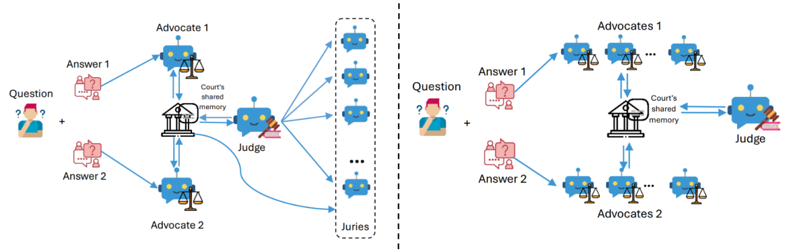

# LLM-Based-Judging-Architectures

<p align="center">
  
</p>

## Background
As large language models (LLMs) evolve, evaluating their outputs becomes increasingly complex. Traditional methods, such as human assessments, are often costly and inconsistent, while automated metrics may fail to capture the nuances of LLM performance.

To address these challenges, we propose a novel framework that uses LLMs as **advocates** in a dynamic, **courtroom-inspired** system. This approach involves LLMs acting as advocates, judges, and juries to provide a comprehensive evaluation of model outputs.

This framework integrates decision theory, bounded rationality, and economic incentives to offer a robust evaluation method. Subsequent sections will detail the architecture and experiments validating its effectiveness.


## Data

### Dataset

This project uses the `lmsys/mt_bench_human_judgments` dataset from Hugging Face.

### Preprocessing

The script `src/preprocess_mt_bench.py` processes the raw data into an Excel file (`data/mt_bench_human_judgments.xlsx`) with the following columns:

- **Question**: Aggregated user questions.
- **Response_A**: Responses from Model A.
- **Response_B**: Responses from Model B.
- **Model_A_Score**: Binary score for Model A (1 for a win, 0 for a loss).
- **Model_B_Score**: Binary score for Model B (1 for a win, 0 for a loss).

Run the preprocessing with:
```bash
python data/preprocess_mt_bench.py
```
## Installation and Setup

Our agentic architecture is built on **MetaGPT**, a framework designed to efficiently manage interactions between agents using shared memory.

To use the MetaGPT framework, follow these steps:

1. **Clone the Repository**  
First, clone the repository and navigate to the relevant directory:
```bash
git clone https://github.com/abirharrasse/LLM-Judging-Architectures  && cd LLM-Judging-Architectures/MetaGPT_LLM_advocates
```

2. **Install Dependencies**
Install the necessary packages:
```bash
pip install --upgrade -e .
pip install together -q
```

3. **Initialize Configuration**
Set up the configuration file for the MetaGPT framework:
```bash
metagpt --init-config
```
Before running this command, ensure you're in the correct directory:
```bash
import os
os.chdir('/content/LLM-Judging-Architectures/MetaGPT_LLM_advocates')
print(os.getcwd())
```
4. **Set API Keys**
Set the required API keys to run your experiments:
```bash
os.environ['OPENAI_API_KEY'] = 'sk-aa'
os.environ['TOGETHER_API_KEY'] = 'c7a811e69a15309841c8651be4b6994bbcc88f33ff75990e9601343bedf0d63a'
os.environ['CLAUDE_API_KEY'] = ''
os.environ['GEMINI_API_KEY'] = ''
os.environ['COHERE_API_KEY'] = ''
```
